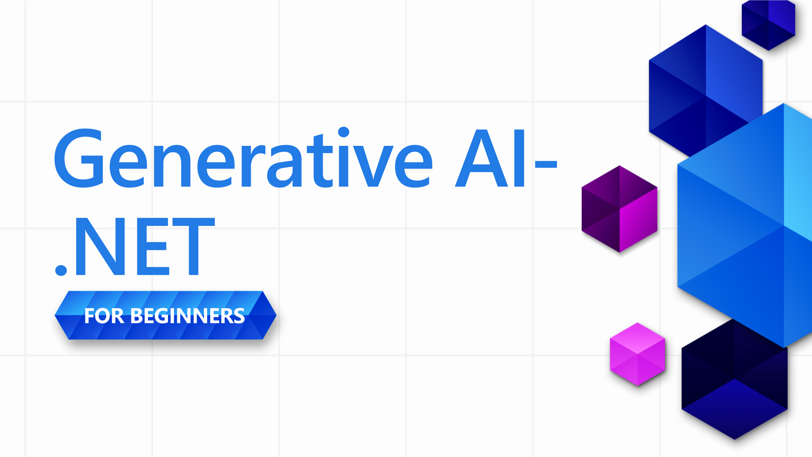

# Generative AI for Beginners .NET - A Course

## Practical lessons teaching you how to build Generative AI applications in .NET

Welcome to **Generative AI for Beginners .NET**, the hands-on course for .NET developers diving into the world of Generative AI!

This isn’t your typical “here’s some theory, good luck” course. This repository is all about **real-world applications** and **live coding** to empower .NET developers to take full advantage of Generative AI.

This is **hands-on**, **practical**, and designed to be **fun**!

Don't forget to [star (🌟) this repo](https://docs.github.com/en/get-started/exploring-projects-on-github/saving-repositories-with-stars) to find it easier later.

➡️Get your own copy by [Forking this repo](https://github.com/microsoft/Generative-AI-for-beginners-dotnet/fork) and find it next in your own repositories.

## ✨ What's New

We're constantly improving this course with the latest AI tools, models, and practical samples:

- **🚀 Microsoft Agent Framework Reaches Release Candidate!**

  [Microsoft Agent Framework](https://devblogs.microsoft.com/foundry/microsoft-agent-framework-reaches-release-candidate/) has reached **Release Candidate** (`1.0.0-rc1`) — the successor to Semantic Kernel for building agents and multi-agent systems in .NET. Our samples are being migrated to the RC APIs. In the meantime, explore 25+ Agent Framework samples covering console apps, web chat, multi-agent workflows, and Foundry integration.

  👉 [Explore the Agent Framework Samples](./06-AgentFx/)

- **🤖 Claude Models with Agent Framework**

  Integrate **Claude models** from Microsoft Foundry with Microsoft Agent Framework! Three comprehensive samples demonstrate:
  - Basic console chat with Claude using `ChatClientAgent`
  - Conversation persistence with thread serialization/deserialization
  - Interactive Blazor web chat application with modern UI
  - Custom `ClaudeToOpenAIMessageHandler` for seamless API bridging
  - Support for Claude Haiku, Sonnet, and Opus models
  
  👉 [Explore the Claude AgentFx Samples](./samples/AgentFx/CLAUDE-SAMPLES-README.md)
  
  Plus a foundational Claude integration sample:
  
  👉 [BasicChat with Claude via Microsoft Foundry](./samples/CoreSamples/BasicChat-11FoundryClaude/)

[View all previous updates in our What's New archive](./10-WhatsNew/readme.md)

## 🚀 Introduction

Generative AI is transforming software development, and .NET is no exception. This course aims to simplify the journey by offering:

- Short 5-10 minute videos for each lesson.
- Fully functional .NET code samples you can run and explore.
- Integration with tools, including **GitHub Codespaces** and **GitHub Models** for seamless setup and fast time-to-code. Optinally, you can also use **Azure OpenAI Services** or **Ollama** for local model hosting.

You'll learn how to implement Generative AI into .NET projects, from basic text generation to building full-fledged solutions using **GitHub Models**, **Azure OpenAI Services** and **local models with Ollama**.

## 📦 Each Lesson Includes

- **Short Video**: A quick overview of the lesson (5-10 minutes).
- **Complete Code Samples**: Fully functional and ready to run.
- **Step-by-Step Guidance**: Simple instructions to help you learn and implement the concepts.
- **Deep Dive References**: This course focuses on the practical implementation of GenAI, to get deeper into the theoretical we also provide links to explanations in [Generative AI for Beginners - A Course](https://github.com/microsoft/generative-ai-for-beginners) when needed.

## 🗃️ Lessons

| #   | **Lesson Link** | **Description** |
| --- | --- | --- |
| 01  | [**Introduction to Generative AI**](./01-IntroToGenAI/readme.md) | <ul><li>What generative AI is and how it differs from traditional programming</li><li>Why .NET is a first-class citizen for AI development</li><li>The Microsoft AI stack and where each piece fits</li><li>How to run samples in GitHub Codespaces or configure local development</li></ul> |
| 02  | [**Generative AI Techniques**](./03-CoreGenerativeAITechniques/readme.md) | <ul><li>How to create chat conversations with context and memory</li><li>How text embeddings work and why they matter</li><li>How to process different content types including images and documents</li><li>How to call AI models using Microsoft.Extensions.AI abstractions</li></ul> |
| 03  | [**AI Patterns and Applications**](./04-PracticalSamples/readme.md) | <ul><li>How to build semantic search that understands meaning</li><li>How to implement retrieval augmented generation (RAG)</li><li>How to create applications that process and understand documents</li><li>When to use each pattern and how to combine them</li></ul> |
| 04  | [**AI Agents with Microsoft Agent Framework**](./06-AgentFx/readme.md) | <ul><li>What makes an agent different from a chatbot</li><li>How to build agents that use tools and take actions</li><li>How to orchestrate multiple agents working together</li><li>How to integrate with Model Context Protocol (MCP)</li></ul> |
| 05  | [**Responsible AI**](./09-ResponsibleGenAI/readme.md) | <ul><li>How to identify and mitigate bias in AI applications</li><li>How to implement content safety and guardrails</li><li>How to build transparency and explainability into your systems</li><li>Ethical considerations specific to agentic systems</li></ul> |

## 🌐 Multi-Language Support

| Language             | Code | Link to Translated README                               | Last Updated |
|----------------------|------|---------------------------------------------------------|--------------|
| Chinese (Simplified) | zh   | [Chinese Translation](./translations/zh/README.md)      | 2025-06-24   |
| Chinese (Traditional)| tw   | [Chinese Translation](./translations/tw/README.md)      | 2025-06-24   |
| French               | fr   | [French Translation](./translations/fr/README.md)       | 2025-06-24   |
| Japanese             | ja   | [Japanese Translation](./translations/ja/README.md)     | 2025-06-24   |
| Korean               | ko   | [Korean Translation](./translations/ko/README.md)       | 2025-06-24   |
| Portuguese           | pt   | [Portuguese Translation](./translations/pt/README.md)   | 2025-06-24   |
| Spanish              | es   | [Spanish Translation](./translations/es/README.md)      | 2025-06-24   |
| German               | de   | [German Translation](./translations/de/README.md)       | 2025-06-24   |

> **Note:** All translations were updated to match the original content on **2025-06-24**. See [PR #161](https://github.com/microsoft/Generative-AI-for-beginners-dotnet/pull/161) for details.

## 🛠️ What You Need

To get started, you'll need:

1. A **GitHub account** (free is fine!) to [fork this entire repo](https://github.com/microsoft/generative-ai-for-beginners-dotnet/fork) to your own GitHub account.

1. **GitHub Codespaces enabled** for instant coding environments. You can enable GitHub Codespaces in your repository settings. Learn more about GitHub Codespaces [here](https://docs.github.com/en/codespaces).

1. Create your copy by [Forking this repo](https://github.com/microsoft/Generative-AI-for-beginners-dotnet/fork), or use the `Fork` button at the top of this page.

1. A basic understanding of **.NET development**. Learn more about .NET [here](https://dotnet.microsoft.com/learn/dotnet/what-is-dotnet).

And that's it.

We've designed this course to be as low-friction as possible. We make use of the following to help you get started quickly:

- **Run in GitHub Codespaces**: With one click, you'll get a pre-configured environment to test and explore the lessons.
- **Leverage GitHub Models**: Try out AI-powered demos hosted directly within this repo, we explain more in the lessons, as we go. *(If you want to learn more about GitHub Models, click [here](https://docs.github.com/github-models))*

Then when you're ready to expand we also have guides for:

- Upgrading to **Azure OpenAI Services** for scalable and enterprise-ready solutions.
- Using **Ollama** to run models locally on your hardware for enhanced privacy and control.

## 🤝 Want to Help?

Contributions are welcome! Here's how you can help:

- [Report issues](https://github.com/microsoft/Generative-AI-for-beginners-dotnet/issues/new) or bugs in the repo.

- Improve existing code samples or add new ones, fork this repo and propose some changes!
- Suggest additional lessons or enhancements.
- Do you have suggestions or found spelling or code errors?, [create a pull request](https://github.com/microsoft/Generative-AI-for-beginners-dotnet/compare)

Check the [CONTRIBUTING.MD](./CONTRIBUTING.MD) file for details on how to get involved.

## 📄 License

This project is licensed under the MIT License - see the [LICENSE](./LICENSE) file for details.

## 🌐 Other Courses

We have a lot of other content to help your learning journey. Check out:

### Generative AI Series

[-9333EA?style=for-the-badge&labelColor=E5E7EB&color=9333EA)](https://github.com/microsoft/Generative-AI-for-beginners-dotnet?WT.mc_id=academic-105485-koreyst)
[-C084FC?style=for-the-badge&labelColor=E5E7EB&color=C084FC)](https://github.com/microsoft/generative-ai-for-beginners-java?WT.mc_id=academic-105485-koreyst)
[-E879F9?style=for-the-badge&labelColor=E5E7EB&color=E879F9)](https://github.com/microsoft/generative-ai-with-javascript?WT.mc_id=academic-105485-koreyst)

---

### Core Learning

## Getting Help

If you get stuck or have any questions about building AI apps, join:

If you have product feedback or errors while building visit:

