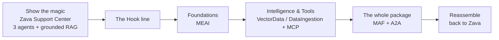

# 01 — Session Concept

> **AI Building Blocks for .NET: Add Intelligence to your C# Apps** · OD805 · 40 min

## 1. The big idea

Most .NET developers have *used* an AI feature by now — a chat box, a "summarize"
button, a copilot. Many have even scaffolded the **AI Chat Web App template** and
watched it answer questions over their own PDFs. It feels like magic.

This session **pulls back the curtain**. We start from a finished, magical app — the
**Zava Support Center**, a polished multi-agent support console — and then **deconstruct
it into the .NET building blocks** that made it possible — the same
`Microsoft.Extensions.*` libraries developers already trust for logging, DI, and
configuration. The arc proves one message:

> **You don't need a new language, a new platform, or a data-science degree to build
> intelligent apps. You need the .NET building blocks you already know — composed.**

## 2. The audience

- .NET / C# developers, intermediate level.
- Have heard of "AI in .NET" but aren't sure what's official vs. glue code.
- Want a clear mental model and a map of *which library does what*.

## 3. The narrative arc (show → hook → deconstruct → reassemble)

### Act 1 — Show the magic (the "we've seen this" moment)

Run the **Zava Support Center** — a support console powered by three agents over **A2A**:
a **Pitch Image Agent** (the incident-hero image is already on screen, via
`IImageGenerator` / GPT-Image-2), an **NVIDIA NeMo** analysis agent, and a **MAF action
agent** that grounds every recommendation in a runbook and answers **with clickable
citations** (`RB-014`, `ASP-001`). Let it land as "this is a real, polished AI app."

### Act 2 — The hook

Deliver the punchy line (candidates below), pause, then promise: *"For the next 30
minutes we're going to build that app's brain, one block at a time — and every block
is just NuGet + C#."*

### Act 3 — Deconstruct into building blocks (the core of the talk)

Walk the sample flow bottom-up, each backed by a tiny, focused demo:

1. **Foundations — Microsoft.Extensions.AI (MEAI)**
   One `IChatClient` abstraction; in **Microsoft Foundry** one endpoint hosts many
   models — swap `gpt-5.5 → grok-4` by changing the deployment name, authenticate with
   **Integrated Security (Entra ID)**, then swap the provider to local Ollama without
   touching app code. This is the "the magic is just an interface" reveal.
2. **Evolve with intelligence & tools**
   - **Microsoft.Extensions.VectorData + Microsoft.Extensions.DataIngestion:** the
     RAG engine from Act 1, demystified — read docs → chunk → embed → store → search.
   - **MCP — the C# MCP SDK:** give the model *tools* and live context from an MCP
     server. "Your model can now call out to the world."
3. **The whole package — Microsoft Agent Framework (MAF)**
   Wrap chat + tools + memory into an **agent**, and compose agents into workflows.
   "This is what the template's `ChatAgent` actually is."

### Act 4 — Reassemble

Flip back to Zava and overlay the block names on it: *"The hero image? `IImageGenerator`.
The chat? `IChatClient`. The grounded citations? VectorData + DataIngestion over local
embeddings. The action agent? MAF. And the NVIDIA agent it talks to? That's A2A. None of
it is a black box anymore."*

## 4. The hook line — candidates

Pick one (recommended in **bold**):

1. **"We've all seen the magic trick. Today we learn the sleight of hand — and it's all just C#."**
2. "You've been *using* AI in .NET. In the next 30 minutes you'll understand exactly how it works — and how much further you can push it."
3. "That chat app felt like magic. Let's open it up — turns out the magic is a handful of NuGet packages you already trust."
4. "Everyone can *call* an AI model. Far fewer know the building blocks behind it — let's fix that, the .NET way."

> Bruno to choose / tweak voice. #1 pairs best with the "deconstruct" visual.

## 5. Key takeaways (the slide they photograph)

- **MEAI** is the foundation: one abstraction (`IChatClient` / `IEmbeddingGenerator`),
  many providers — and in Foundry, many models behind one endpoint with Integrated Security.
- **VectorData + DataIngestion** = the official RAG pipeline building blocks.
- **MCP (C# SDK)** = standard way to give models tools and context.
- **MAF** = agents and multi-agent workflows on top of all of the above.
- It's all **`Microsoft.Extensions.*`** — composable, testable, production-grade .NET.

## 6. Non-goals (keep it tight for 40 min)

- Not a deep dive into prompt engineering or model training.
- Not a cloud-architecture or cost talk.
- Not exhaustive provider coverage — Azure OpenAI + Ollama are enough to make the point.
- No live Azure provisioning on stage (pre-provisioned; see constraints doc).
